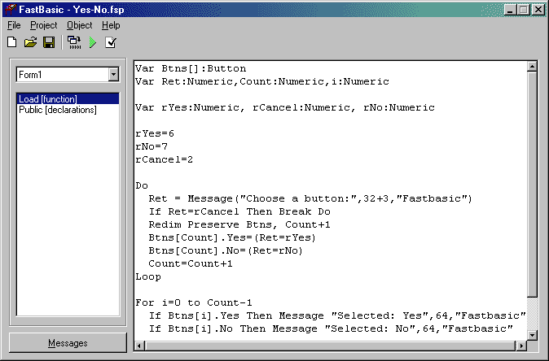



## Fastbasic compiler 2\.0

### Description

Updated 5/6/2003. This is a new version of the FastBasic compiler. Besides if's, do's and stuff like that, the language supports structures (UDTs) and arrays (fixed size and dynamic). Also a quick introduction to the language is provided. See the example programs for more information.
 
### More Info
 

             |
---                |---
**Submitted On**   |2003-05-06 00:46:34
**By**             |[Paul Guerra](https://github.com/Planet-Source-Code/PSCIndex/blob/master/ByAuthor/paul-guerra.md)
**Level**          |Advanced
**User Rating**    |4.7 (28 globes from 6 users)
**Compatibility**  |VB 6\.0
**Category**       |[Complete Applications](https://github.com/Planet-Source-Code/PSCIndex/blob/master/ByCategory/complete-applications__1-27.md)
**World**          |[Visual Basic](https://github.com/Planet-Source-Code/PSCIndex/blob/master/ByWorld/visual-basic.md)
**Archive File**   |[Fastbasic\_158409552003\.zip](https://github.com/Planet-Source-Code/paul-guerra-fastbasic-compiler-2-0__1-45163/archive/master.zip)

